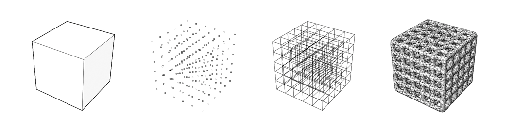

## Overview

Intralattice is a collection of generative CAD components for [Grasshopper](http://www.grasshopper3d.com/), used to generate solid lattice structures within a 3D design space. It was developed as an extensible, open-source alternative to current commercial solutions. 

**Website** - http://intralattice.com

As an ongoing project developed at McGill’s Additive Design & Manufacturing Laboratory (ADML), it has been a valuable research tool, serving as a platform for breakthroughs in multi-scale design and optimization. By giving you full access to the source, we hope to collectively explore lattice design at a deeper level, and consequently, engineer better products.

## Core Components

The generative process is divided into the following modules.

1. **CELL** - Defines a unit cell topology.
  * [PresetCell](./src/IntraLattice/CORE/Components/Cell/PresetCellComponent.cs) - Library of built-in unit cells
  * [CustomCell](./src/IntraLattice/CORE/Components/Cell/CustomCellComponent.cs) - Input for user-defined unit cell (includes validation)

2. **FRAME** - Generates a lattice frame by mapping the unit cell topology to a design space.
  * [BasicBox](./src/IntraLattice/CORE/Components/Frame/BasicBoxComponent.cs) - Simple box lattice
  * [BasicCylinder](./src/IntraLattice/CORE/Components/Frame/BasicCylinderComponent.cs) - Simple cylinder lattice
  * [ConformSS](./src/IntraLattice/CORE/Components/Frame/ConformSSComponent.cs) - Conforming Surface-to-Surface lattice
  * [ConformSA](./src/IntraLattice/CORE/Components/Frame/ConformSAComponent.cs) - Conforming Surface-to-Axis lattice
  * [ConformSP](./src/IntraLattice/CORE/Components/Frame/ConformSPComponent.cs) - Conforming Surface-to-Point lattice
  * [UniformDS](./src/IntraLattice/CORE/Components/Frame/UniformDSComponent.cs) - Trimmed Uniform Lattice (within Brep or Mesh)

3. **MESH** - Generates solid mesh of the lattice frame.
  * [Homogen](./src/IntraLattice/CORE/Components/Mesh/HomogenComponent.cs) - Homogeneous (constant strut radius)
  * [HeterogenGradient](./src/IntraLattice/CORE/Components/Mesh/HeterogenGradientComponent.cs) - Heterogeneous (gradient-based strut radius)
  * [HeterogenCustom](./src/IntraLattice/CORE/Components/Mesh/HeterogenCustomComponent.cs) - Heterogeneous (custom strut radius)

4. **UTILS** - Extra components for pre/post-processing.
  * [AdjustUV](./src/IntraLattice/CORE/Components/Utility/AdjustUVComponent.cs) - Adjust UV-map of a surface
  * [CleanNetwork](./src/IntraLattice/CORE/Components/Utility/CleanNetworkComponent.cs) - Removes duplicate curves from a list of curves
  * [MeshReport](./src/IntraLattice/CORE/Components/Utility/MeshReportComponent.cs) - Validate a mesh (printability)
  * [MeshPreview](./src/IntraLattice/CORE/Components/Utility/MeshReportComponent.cs) - Preview a mesh

## Core Data
Many of the relevant algorithms, and data structures, are encapsulated in the following classes.

  * [UnitCell](./src/IntraLattice/CORE/Data/UnitCell.cs) - For constructing/validating unit cell.
  * [Lattice](./src/IntraLattice/CORE/Data/Lattice.cs) - For lattice wireframe mapping.
  * [ExoMesh](./src/IntraLattice/CORE/Data/ExoMesh.cs) - For solid mesh generation.
  * [EndoMesh](./src/IntraLattice/CORE/Data/EndoMesh.cs) - Coming soon

